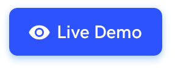

<h1 align="center" style="border-bottom: none !important; margin-bottom: 5px !important;"><a href="https://designrevision.com/downloads/shards-dashboard-lite-react/">Shards Dashboard React</a></h1>

  
  

A free React admin dashboard template pack featuring a modern design system    and lots of custom templates and components.
This fork includes REDUX instead Flux and HOC for Sidebar

  
  

 

 

> ✨ **Note:** You can download the Sketch files from the official product page.

 

### Quick Start

* Install dependencies by running `yarn` or `npm install`.
* Run `yarn start` or `npm run start` to start the local development server.
* 😎 **That's it!** You're ready to start building awesome dashboards.

 
